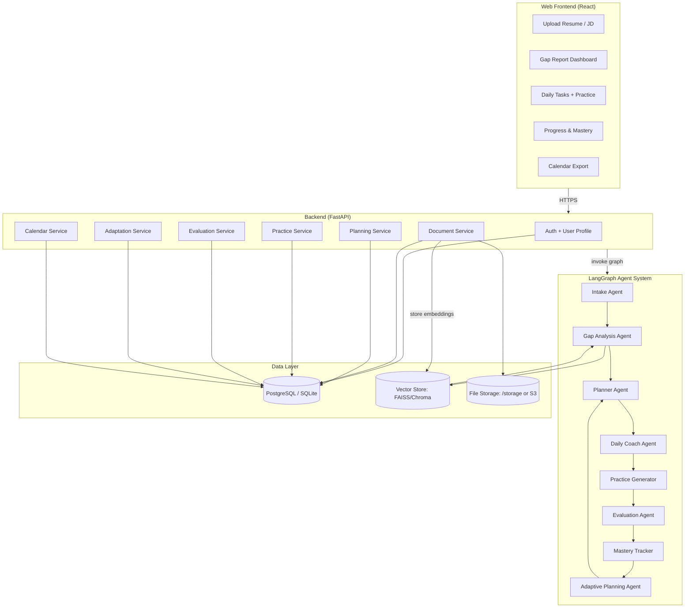
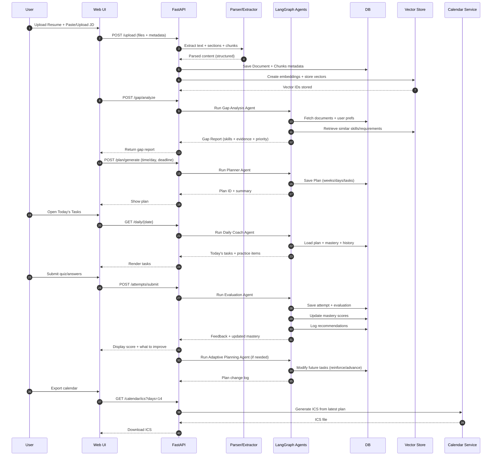
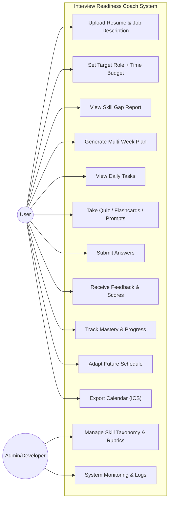
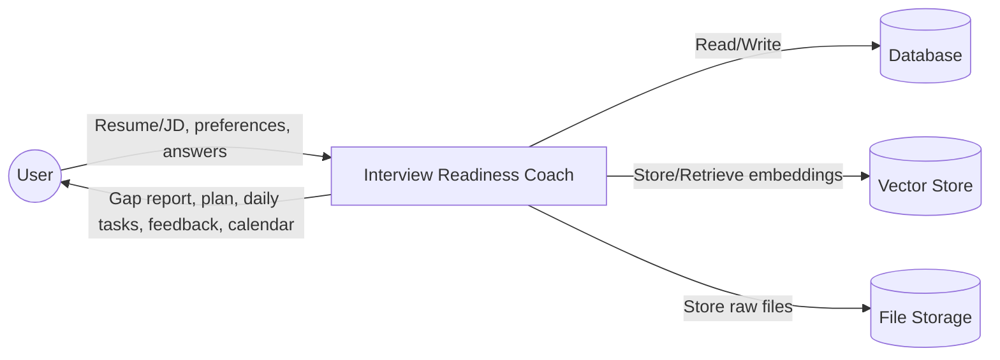

# Agentic Multi Modal Interview Readiness Coach

## Project Overview

An intelligent, agentic interview preparation system that analyzes a user’s resume and target job description to identify skill gaps, generate a personalized multi-week study plan, deliver daily practice (quizzes, flashcards, challenges), evaluate responses, and adapt the plan over time based on performance and consistency.

The system functions as a **stateful AI coach**, combining planning, evaluation, memory, and adaptation into a unified experience. It integrates real-world constraints such as time availability, interview deadlines, and forgetting curves, and supports calendar-based accountability.

---

## Key Features

- **Multi-Modal Intake**
  - Resume upload (PDF/DOCX)
  - Job description input (text or PDF)
  - Optional preferences (time/day, weak areas, interview date)

- **Skill Gap Analysis**
  - Extracts required skills from job description
  - Extracts demonstrated skills from resume
  - Produces evidence-backed gap reports with priority scoring

- **Agentic Planning**
  - Multi-week, constraint-aware study plan
  - Daily task decomposition (learn → practice → review)
  - Explicit reasoning for why each task is scheduled

- **Daily Practice Engine**
  - Quizzes (MCQ, short-answer)
  - Flashcards (spaced repetition)
  - Behavioral interview prompts (STAR-based)
  - System design prompts with evaluation rubrics

- **Evaluation & Feedback**
  - LLM-based rubric scoring
  - Weakness identification
  - Actionable improvement feedback

- **Progress Tracking & Adaptation**
  - Mastery scores per skill
  - Automatic plan adjustment based on performance
  - Streaks, completion tracking, and reinforcement scheduling

- **Calendar Integration**
  - ICS calendar export for daily study reminders
  - Regeneration when plans adapt

---

## Technology Stack

| Component | Technology |
|--------|------------|
| Agent Orchestration | LangGraph |
| Agent Framework | LangChain |
| LLM | OpenAI / Anthropic / Ollama |
| Backend API | FastAPI |
| Frontend | React + Vite + Tailwind CSS |
| Persistence | PostgreSQL / SQLite |
| Vector Search | FAISS / Chroma |
| Observability | LangSmith |
| Calendar | ICS export (Google Calendar V2) |

---

### Architecture Diagram

### Sequence Diagram: Resume + JD → Plan → Daily Practice → Adaptation Loop

### Use Case Diagram

### Data Flow Diagram
#### DFD Level 0 (Context Diagram)

## Core Capabilities

### 1. Skill Extraction & Evidence Mapping
- Resume skill inference with evidence snippets
- Job description requirement extraction
- Coverage scoring: Covered / Partial / Missing

### 2. Planning Under Constraints
- Time-budget aware scheduling
- Interview deadline alignment
- Priority-based topic ordering

### 3. Practice Generation
- Difficulty-controlled quizzes
- Behavioral question generation aligned to role level
- System design prompts with structured expectations

### 4. Evaluation & Feedback
- Rubric-based LLM evaluation
- Confidence and clarity scoring
- Identification of misconceptions

### 5. Adaptive Learning Loop
- Mastery tracking per skill
- Automatic reinforcement scheduling
- Reduction of repetition for mastered topics

